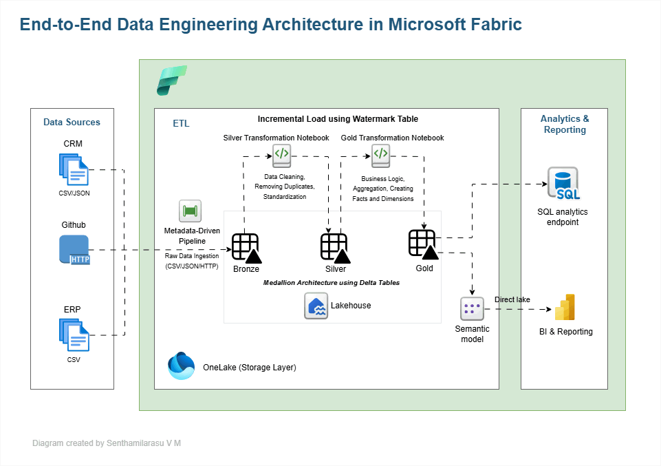

# Fabric Medallion Analytics

# Project Overview

This project demonstrates an end-to-end Microsoft Fabric Data Engineering solution built using the Medallion Architecture approach.

The solution ingests data from multiple source systems including:

* CSV files
* JSON files
* GitHub raw HTTP sources

and processes them through Bronze, Silver and Gold layers inside a Microsoft Fabric Lakehouse.

The architecture is designed to simulate a scalable enterprise analytics platform using modern Lakehouse engineering principles in Microsoft Fabric.

---

# Key Features Implemented

* Metadata-driven ingestion pipeline
* Dynamic pipeline orchestration
* Incremental loading using Watermark table
* Delta Lakehouse architecture
* Spark SQL transformations
* Semantic modeling
* SQL analytics endpoint integration
* Direct Lake ready architecture
* Enterprise-style monitoring and notification activities

---

# Architecture

<p align="center">
  
</p>

### Data Sources

* CRM CSV / JSON files
* ERP CSV files
* GitHub raw files using HTTP connection

### Bronze Layer

* Raw ingestion layer
* Delta table creation
* Metadata-driven ingestion

### Silver Layer

* Data cleansing
* Standardization
* Business rule implementation
* Duplicate handling

### Gold Layer

* Star schema model
* Fact and Dimension tables
* Business-ready analytical layer

### Analytics & Reporting

* Semantic Model
* SQL Analytics Endpoint
* Direct Lake ready architecture
* Power BI reporting capability

---

# Repository Structure

```text
fabric-medallion-analytics/
│
├── data_source/
├── notebooks/
├── pipelines/
├── screenshots/
└── README.md
```

---

# Project Setup & Execution

## 1. Create Lakehouse

Create a Lakehouse with the following name:

```text
sales_lakehouse
```

---

## 2. Upload Source Files

Upload the CSV and JSON source files into:

```text
Lakehouse → Files
```

### Steps

1. Open:

```text
sales_lakehouse
```

2. Navigate to:

```text
Files
```

3. Create the following folders if they do not exist:

```text
crm
erp
```

4. Upload the corresponding CSV and JSON files into the appropriate folders.

### Expected Folder Structure

```text
Files/
│
├── crm/
│   ├── sales_details.csv
│   └── prd_info.json
│
└── erp/
    ├── CUST_AZ12.csv
    ├── LOC_A101.csv
    └── PX_CAT_G1V2.csv
```

### Important

Ensure:

* File names match the values inside `config_ingestion`(table we are about to create)
* Folder structure matches configured source paths
* CSV and JSON files are uploaded to the correct folders
* The current implementation ingests `cust_info.csv` dynamically from a GitHub raw HTTP source

These files are dynamically ingested by the metadata-driven pipeline to create Bronze Delta tables.

---

## GitHub Raw URL Configuration

For GitHub ingestion:

* Open the file in GitHub
* Click:

```text
Raw
```

* Copy the generated URL

For the HTTP connection, use:

```text
https://raw.githubusercontent.com/
```

The remaining dynamic path is maintained inside the `config_ingestion` table.

This allows the pipeline to dynamically ingest GitHub files.

---

## 3. Create Config Table

Run notebook:

```text
00_NB_CONFIG_INGESTION
```

This notebook creates and populates the metadata-driven configuration table used by the ingestion pipeline.

---

# Notebook Configuration

Before running notebooks:

Select:

```text
Spark SQL
```

as the notebook language.

Although:

```text
%%sql
```

is already used inside notebooks, manually selecting Spark SQL helps avoid execution inconsistencies.

---

# Default Lakehouse Configuration

After importing notebooks, you may encounter errors like:
"Default Lakehouse is not accessible" or "Couldn't load artifact"

1. Remove the old Lakehouse reference
2. Click **Add Data Items**
3. From OneLake catalog
4. Select the correct Lakehouse
5. Click **... → Set as Default Lakehouse**
6. Restart the Spark session

### Why this is needed

The notebook retains a reference to an old Lakehouse ID, even if a Lakehouse with the same name exists. Fabric notebooks bind to Lakehouse ID, not name.

Setting the correct default Lakehouse ensures:

* Delta tables are accessible
* SQL objects resolve correctly
* Notebook execution uses the correct Lakehouse context

---

## 4. Create Watermark Table

Run notebook:

```text
01_NB_WATERMARK_TABLE_SETUP
```

This creates the watermark table used for incremental loading.

---

# Bronze Layer Setup

## 5. Import Pipeline

Import the pipeline:

```text
PL_INGEST_TRANSFORM_BRONZE_TO_GOLD
```

---

## 6. Disable Incremental Activities Initially

Before the first pipeline execution:

Deactivate the following activities temporarily:

* Incremental notebook activities
* Semantic Model Refresh activity
* Office 365 Email activity

### How to deactivate

* Right-click the activity
* Select:

```text
Deactivate
```

This ensures only Bronze ingestion is executed during the initial setup.

---

## 7. Run Pipeline

Run the pipeline manually.

Once completed successfully:

* 6 Bronze Delta tables will be created

---

## 8. Validate Bronze Layer

Run notebook:

```text
02_NB_BRONZE_DATA_QUALITY
```

Validation checks include:

* Row counts
* Null checks
* Duplicate checks
* Bronze data quality validation

---

# Silver Layer Setup

## 9. Run Silver Full Load

Run notebook:

```text
03_NB_SILVER_FULL_LOAD
```

Once completed successfully:

* 6 Silver tables will be created

---

## 10. Validate Silver Layer

Run notebook:

```text
04_NB_SILVER_DATA_QUALITY
```

Validation checks include:

* Data cleansing validation
* Standardization validation
* Business rule validation
* Silver layer quality checks

---

# Gold Layer Setup

## 11. Run Gold Full Load

Run notebook:

```text
06_NB_GOLD_FULL_LOAD
```

Once completed successfully:

* 2 Dimension tables will be created
* 1 Fact table will be created

---

## 12. Validate Gold Layer

Run notebook:

```text
07_NB_GOLD_DATA_QUALITY
```

Validation checks include:

* Fact table validation
* Dimension relationship validation
* Surrogate key mapping validation
* Gold model validation

---

# 13. Create Semantic Model

Inside:

```text
sales_lakehouse
```

click:

```text
New Semantic Model
```

Select the following tables:

* `gold_fact_sales`
* `gold_dim_customers`
* `gold_dim_products`

Create the relationships to form a proper Star Schema model.

This ensures:

* Direct Lake connectivity
* Semantic layer creation
* BI consumption readiness
* SQL analytics compatibility

---

# Incremental Load Testing

## 14. Insert Incremental Test Records

Run notebook:

```text
09_NB_INCREMENTAL_TEST_DATA_LOAD
```

This notebook manually inserts new records into the source tables to simulate newly arrived data.

---

## 15. Validate Existing Row Counts

Run notebook:

```text
10_NB_INCREMENTAL_LOAD_VALIDATION
```

This captures row counts before incremental execution.

---

## 16. Enable Incremental Activities

Before running the pipeline for incremental loading:

Make sure all activities are activated again, including:

* Incremental notebook activities

The pipeline also includes:

* Semantic Model Refresh activity
* Office 365 Email notification activity

### Semantic Model Refresh

Configure the refresh activity using the Semantic Model created from:

* `gold_fact_sales`
* `gold_dim_customers`
* `gold_dim_products`

### Office 365 Email Activity

Configure:

* Recipient email addresses
* Failure dependency conditions

This simulates enterprise-style orchestration and monitoring

---

## 17. Verify Copy Activity Table Action

Inside Copy Activity:

Ensure table action is set to:

```text
Append
```

instead of:

```text
Overwrite
```

### Why Append is required

Incremental processing should preserve existing Bronze records and append only newly arrived records.

Using:

```text
Overwrite
```

would replace the Bronze data during every execution.

---

## 18. Run Pipeline Again

Run the pipeline manually once again.

This time:

* Newly added records should load incrementally
* Watermark logic should prevent duplicate processing
* Silver and Gold layers should process only new records
* Semantic Model Refresh activity should refresh the semantic model automatically
* Email Activity sends out an email to the recipient if the pipeline fails 

---

## 19. Validate Incremental Load

Run notebook:

```text
10_NB_INCREMENTAL_LOAD_VALIDATION
```

Validation checks include:

* Incremental row movement
* Watermark updates
* Bronze → Silver → Gold propagation
* Successful incremental processing

---

# Challenges Solved

* Dynamic ingestion from multiple source types
* GitHub HTTP ingestion using raw URLs
* Metadata-driven ETL implementation
* Incremental processing using watermark tables
* CSV and JSON ingestion handling
* Delta table processing in Fabric
* Dynamic pipeline orchestration
* Medallion architecture implementation

---

# Screenshots

The repository includes screenshots for:

* Pipeline execution
* Incremental loading
* Notebook execution
* Bronze, Silver, and Gold tables
* Semantic Model configuration
* Architecture diagram

---

# About This Project

This project was built to demonstrate practical Microsoft Fabric Data Engineering implementation using modern Lakehouse architecture principles.

The implementation focuses on:

* Dynamic orchestration
* Metadata-driven ingestion
* Incremental processing
* Scalable Lakehouse architecture
* Enterprise-style pipeline design

---

# Author

**Senthamilarasu V M**

BI Lead | Power BI Developer | Microsoft Fabric Developer
